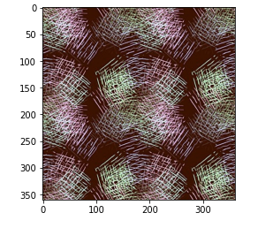
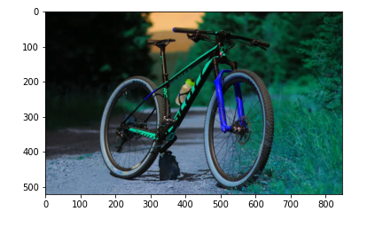
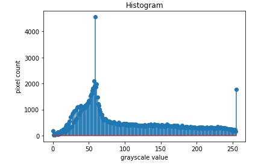
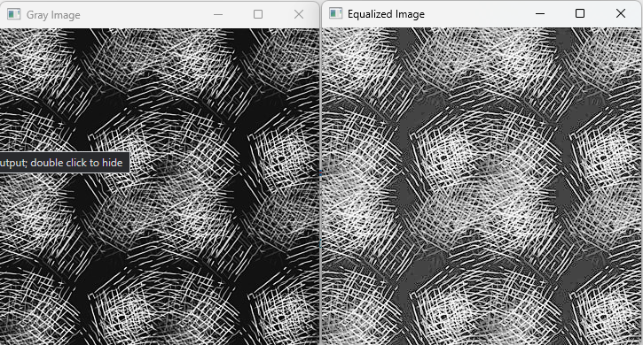

# Histogram and Histogram Equalization of an image
## Aim
To obtain a histogram for finding the frequency of pixels in an Image with pixel values ranging from 0 to 255. Also write the code using OpenCV to perform histogram equalization.

## Software Required:
Anaconda - Python 3.7

## Algorithm:
### Step1:
 Import the necessary libraries and read two images, Color image and Gray Scale image.
### Step2:
Calculate the Histogram of Gray scale image and each channel of the color image.
### Step3:
Display the histograms with their respective images.
### Step4:
Equalize the grayscale image.
### Step5:
Display the grayscale image.
## Program:
```python
# Developed By: P.SANDEEP
# Register Number: 212221230074
```
```
import cv2
import matplotlib.pyplot as plt
```
## Write your code to find the histogram of gray scale image and color image channels.
```
Gray_image=cv2.imread('bg.png')
plt.imshow(Gray_image)
plt.show()
hist=cv2.calcHist([Gray_image],[0],None,[256],[0,256])
plt.figure()
plt.title("Histogram")
plt.xlabel('grayscale value')
plt.ylabel('pixel count')
plt.stem(hist)
plt.show()
```

## Display the histogram of gray scale image and any one channel histogram from color image
```
Color_image=cv2.imread('bike.png')
plt.imshow(Color_image)
plt.show()
hist1=cv2.calcHist([Color_image],[1],None,[256],[0,256])
plt.figure()
plt.title("Histogram")
plt.xlabel('Intensity value')
plt.ylabel('pixel count')
plt.stem(hist1)
plt.show()
```
## Write the code to perform histogram equalization of the image. 
```
Gray_image=cv2.imread('bg.png',0)
equ=cv2.equalizeHist(Gray_image)
cv2.imshow('Gray Image',Gray_image)
cv2.imshow('Equalized Image',equ)
cv2.waitKey(0)
cv2.destroyAllWindows()
```
## Output:
### Input Grayscale Image and Color Image


<br>
### Histogram of Grayscale Image and any channel of Color Image


<br>
### Histogram Equalization of Grayscale Image

<br>
## Result: 
Thus the histogram for finding the frequency of pixels in an image with pixel values ranging from 0 to 255 is obtained. Also,histogram equalization is done for the gray scale image using OpenCV.
